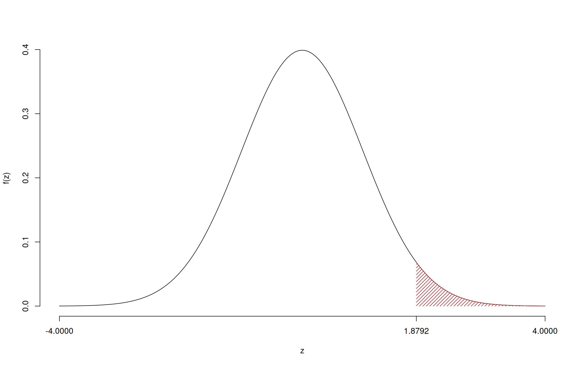

---
editor_options:
  chunk_output_type: console
date: " "
output:
  bookdown::pdf_document2:
    latex_engine: xelatex
    keep_tex: true
    toc: false
    includes:
      in_header: preamble.tex
    number_sections: false
  pdf_document:
    toc: false
    toc_depth: '6'
  html_document:
    css: sol.css
    toc: true
    toc_depth: 6
    toc_float:
      collapsed: false
      smooth_scroll: false
      df_print: paged
fontsize: 10pt
geometry: top=2cm,bottom=1.5cm,left=1.5cm,right=1.5cm
---

# Prova di Statistica (CLEAM)

\vspace*{-1.4cm}
\anagrafica{}

\thispagestyle{fancy}
\fancypagestyle{firstpage}{%
  \lhead{\textbf{Prova di Statistica (CLEAM)}}
  \rhead{\texttt{UDIJPW30U1O2L46}}
  \cfoot{} % Rimuove il numero di pagina
}
\pagestyle{firstpage}

### Esercizio 1 

Su un campione di $350$ aziende è stato rilevato il costo annuo in gas metano (espresso in migliaia di euro). Qui di seguito i dati e le frequenze percentuali

<table class="table" style="width: auto !important; margin-left: auto; margin-right: auto;">
 <thead>
  <tr>
   <th style="text-align:right;"> $[\text{x}_j,$ </th>
   <th style="text-align:right;"> $\text{x}_{j+1})$ </th>
   <th style="text-align:right;"> $f_{j\%}$ </th>
  </tr>
 </thead>
<tbody>
  <tr>
   <td style="text-align:right;"> 0.0 </td>
   <td style="text-align:right;"> 2.5 </td>
   <td style="text-align:right;"> 9.143 </td>
  </tr>
  <tr>
   <td style="text-align:right;"> 2.5 </td>
   <td style="text-align:right;"> 4.0 </td>
   <td style="text-align:right;"> 36.286 </td>
  </tr>
  <tr>
   <td style="text-align:right;"> 4.0 </td>
   <td style="text-align:right;"> 6.5 </td>
   <td style="text-align:right;"> 36.286 </td>
  </tr>
  <tr>
   <td style="text-align:right;"> 6.5 </td>
   <td style="text-align:right;"> 10.0 </td>
   <td style="text-align:right;"> 18.286 </td>
  </tr>
</tbody>
</table>

1.a (pt 13/98 → 4.1/31) Calcolare la colonna delle densità percentuali.

::: {.sol data-latex=""}
<table class="table" style="width: auto !important; margin-left: auto; margin-right: auto;">
 <thead>
  <tr>
   <th style="text-align:right;"> $[\text{x}_j,$ </th>
   <th style="text-align:right;"> $\text{x}_{j+1})$ </th>
   <th style="text-align:right;"> $n_j$ </th>
   <th style="text-align:right;"> $f_j$ </th>
   <th style="text-align:right;"> $b_j$ </th>
   <th style="text-align:right;"> $h_j$ </th>
  </tr>
 </thead>
<tbody>
  <tr>
   <td style="text-align:right;"> 0.0 </td>
   <td style="text-align:right;"> 2.5 </td>
   <td style="text-align:right;"> 32 </td>
   <td style="text-align:right;"> 0.0914 </td>
   <td style="text-align:right;"> 2.5 </td>
   <td style="text-align:right;"> 3.657 </td>
  </tr>
  <tr>
   <td style="text-align:right;"> 2.5 </td>
   <td style="text-align:right;"> 4.0 </td>
   <td style="text-align:right;"> 127 </td>
   <td style="text-align:right;"> 0.3629 </td>
   <td style="text-align:right;"> 1.5 </td>
   <td style="text-align:right;"> 24.191 </td>
  </tr>
  <tr>
   <td style="text-align:right;"> 4.0 </td>
   <td style="text-align:right;"> 6.5 </td>
   <td style="text-align:right;"> 127 </td>
   <td style="text-align:right;"> 0.3629 </td>
   <td style="text-align:right;"> 2.5 </td>
   <td style="text-align:right;"> 14.514 </td>
  </tr>
  <tr>
   <td style="text-align:right;"> 6.5 </td>
   <td style="text-align:right;"> 10.0 </td>
   <td style="text-align:right;"> 64 </td>
   <td style="text-align:right;"> 0.1829 </td>
   <td style="text-align:right;"> 3.5 </td>
   <td style="text-align:right;"> 5.224 </td>
  </tr>
</tbody>
</table>

:::

 1.b (pt 4/98 → 1.3/31) Calcolare il numero approssimato di aziende con consumo di gas inferiore al 25-esimo percentile $x_{0.25}$. 

::: {.sol data-latex=""}
Per definizione
$$
\%(X\le x_{0.25})=25\%
$$
$n=350$ e quindi il 25% di 350 è
$$
350\times0.25=87.5
$$
:::

1.c (pt 2/98 → 0.6/31) È vero che la media aritmetica minimizza la somma dei valori assoluti degli scarti? Perché?

::: {.sol data-latex=""}
È la mediana che minimizza la somma dei valori assoluti degli scarti. Siccome media e mediana, in generale non coincidono allora no, la media non minimizza la somma dei valori assoluti degli scarti.
:::

### Esercizio 2 

2.a (pt 13/98 → 4.1/31) Si consideri un'urna che ha 5 palline bianche, 5 nere e 5 verdi. Si estrae 3 volte **con**  reinserimento. Sia $X$ la variabile casuale che conta il numero di bianche su 3 estrazioni. Calcolare la probabilità che $X\leq 1$.

:::{.sol data-latex=""}
 \normalsize 
   \begin{eqnarray*}
      P( X \leq 1 ) &=& \binom{ 3 }{ 0 } 0.3333 ^{ 0 }(1- 0.3333 )^{ 3 - 0 }+\binom{ 3 }{ 1 } 0.3333 ^{ 1 }(1- 0.3333 )^{ 3 - 1 } \\                 &=& 0.2963+0.4444 \\                 &=& 0.7407 
   \end{eqnarray*}
   \normalsize 
:::  

2.b (pt 4/98 → 1.3/31) Si consideri un'urna che ha 5 palline bianche, 5 nere e 5 verdi. Si estrae 3 volte **senza**  reinserimento. Sia $X$ la variabile casuale che conta il numero di bianche su 3 estrazioni. Calcolare la probabilità che $X\leq 1$.

:::{.sol data-latex=""}
\begin{eqnarray*}
  B_i &=& \text{Bianca all'estrazione $i$}\\
  \bar B_i &=& \text{Non Bianca all'estrazione $i$}\\
  P(X\le 1) &=&  P(X=0) + P(X=1)\\
   &=& P(\bar B_1\cap\bar B_2\cap\bar B_3)+\\
   &+&P(B_1\cap\bar B_2 \cap \bar B_3)+P(\bar B_1\cap B_2 \cap \bar B_3)+P(\bar B_1\cap\bar B_2 \cap B_3)\\
   &=& \frac {10}{15}\frac {9}{14}\frac {8}{13}+3\cdot\frac {5}{15}\frac {10}{14}\frac {9}{13}\\
  &=& 0.3956
\end{eqnarray*}
:::

2.c (pt 2/98 → 0.6/31) Sia $X$ una VC definita su $S_X=\{0,1,2,3\}$, posto $Y=2X$ ricavare $S_Y$.

2.d (pt 2/98 → 0.6/31) Sia $X$ una VC, e siano $P(X\leq 1)=0.1$, $P(X> 2)=0.1$. Calcolare
$$
P(X>2|X>1)
$$

:::{.sol data-latex=""}
\begin{eqnarray}
  P(X>2|X>1) &=&  \frac{P({X>2}\cap {X>1})}{P(X> 1)}\\
             &=&  \frac{P({X>2})}{P(X> 1)}\\
             &=&   \frac{0.1}{1-0.1}\\
             &=& 0.1111
\end{eqnarray}
:::  

### Esercizio 3 

3.a (pt 13/98 → 4.1/31) Un'urna contiene 2 palline numerate con $\fbox{0}$, 6 numerate con $\fbox{1}$ e 2 numerate con $\fbox{2}$. Si estrae 100 volte con reinserimento. Qual è la probabilità che la proporzione di palline col numero $\fbox{1}$ sia minore di 0.55?

:::{.sol data-latex=""}
$$
\pi = P(\text{estrarre $\fbox{1}$})=\frac {6}{10}=0.6
$$
**Teorema del Limite Centrale (proporzione)** 

 Siano $X_1$,...,$X_n$, $n=100$ VC IID, tc $X_i\sim\text{Ber}(\pi=0.6)$$,\forall i$, posto:
      \[
      \hat\pi=\frac{S_n}n = \frac{X_1 + ... + X_n}n
      \]
      allora:\begin{eqnarray*}
  \hat\pi & \mathop{\sim}\limits_{a}& N(\pi,\pi(1-\pi)/n) \\
  &\sim & N\left(0.6,\frac{0.6\cdot(1-0.6)}{100}\right) \\
     &\sim & N(0.6,0.0024) 
  \end{eqnarray*}\begin{eqnarray*}
      P( \hat\pi   <   0.55 ) 
        &=& P\left(  \frac { \hat\pi  -  \pi }{ \sqrt{\pi(1-\pi)/n} }  <  \frac { 0.55  -  0.6 }{\sqrt{ 0.0024 }} \right)  \\
                 &=& P\left(  Z   <   -1.02 \right) \\    
                 &=&  1-\Phi( 1.02 ) \\ &=&  0.1539 
      \end{eqnarray*}
:::

### Esercizio 4 

  
4.a (pt 3/98 → 0.9/31) Se $h$ è uno stimatore tale che la sua distorsione va a zero per $n$ che tende all'infinito:
$$
\lim_{n\to \infty}B(h)=0
$$
di quale proprietà gode $h$?

::: {.sol data-latex=""}
Osserviamo che
\begin{align*}
B(h) &= E(h)-\theta&\text{e quindi}\\
\lim_{n\to\infty}B(h)&=0\\
\lim_{n\to\infty}(E(h)-\theta)&=0 &\text{se e solo se}\\
\lim_{n\to\infty}E(h)&=\theta &\text{cioè $h$ è asintoticamente corretto}
\end{align*}
:::

4.b (pt 3/98 → 0.9/31) Definire la funzione di verosimiglianza della Bernoulli.

::: {.sol data-latex=""}
La verosimiglianza è
\begin{eqnarray*}
L(\pi)     &\propto& \prod_{i=1}^n \pi^{x_i}(1-\pi)^{1-x_i}\\
           &=& \pi^{s_n}(1-\pi)^{n-s_n}, \qquad s_n=\sum_{i=1}^n x_i
\end{eqnarray*}
:::

4.c (pt 3/98 → 0.9/31) Un dado, che non sappiamo se è perfetto oppure no, viene lanciato 40 volte.
Posto $\pi_i$ la probabilità che il dado mostri la faccia $i$, $i=1,...,6$, si è testato
$$
\begin{cases}
H_0:\pi_1=\pi_2=...=\pi_6=\frac 16
\end{cases}
$$
ed è risultato $p_\text{value}=0.21$. Possiamo concludere che il dado sia truccato?

::: {.sol data-latex=""}
Il $p_\text{value}=0.21>0.05$ non c'è motivo per rifiutare $H_0$, quindi il dado non è truccato.
:::

### Esercizio 5 

Nel comune $A$ si è condotta un'intervista per conoscere l'opinione dei cittadini sulla presenza di un ripetitore 5G.
Sono state intervistate 130 persone e 91 hanno dichiarato di essere favorevoli.

5.a (pt 3/98 → 0.9/31) Costruire un intervallo di confidenza al 95% per la proporzione $\pi$ di cittadini favorevoli nel comune $A$.

:::{.sol data-latex=""}

 $1-\alpha =0.95$ e quindi $\alpha=0.05\rightarrow \alpha/2=0.025$

\[
  \hat\pi = \frac{S_n}n = \frac{ 91 }{ 130 }= 0.7 
\]

\begin{eqnarray*}
  Idc: & &  \hat\pi \pm  z_{\alpha/2} \times \sqrt{\frac{\hat\pi(1-\hat\pi)}{n}} \\
     & &  0.7 \pm  1.96 \times \sqrt{\frac{ 0.7 (1- 0.7 )}{ 130 }} \\
     & &  0.7 \pm  1.96 \times  0.04019 \\
     & & [ 0.6212 ,  0.7788 ]
\end{eqnarray*}
:::

5.b (pt 10/98 → 3.2/31) Studi analoghi, condotti sull'intero territorio nazionale, hanno mostrato una proporzione pari $\pi=0.62$.
 Testare l'ipotesi che la proporzione di cittadini favorevoli nel comune $A$ sia uguale a quella nazionele $\pi=0.62$, contro l'alternativa che sia maggiore. Risolvere con il $p_\text{value}$ e confrontarlo per $\alpha = 0.1,\ 0.05,\ 0.01,\ 0.001$.

:::{.sol data-latex=""}
**Test $Z$ per una proporzione**

La stima
   $$\hat\pi=\frac { 91 } { 130 }= 0.7  $$

 \(\fbox{A}\) FORMULAZIONE DELLE IPOTESI 

   $$\begin{cases}
   H_0: \pi = \pi_0=0.62 \\
   H_1: \pi > \pi_0=0.62 
   \end{cases}$$

 \(\fbox{B}\) SCELTA E CALCOLO STATISTICA-TEST, \(Z\)
        Test Binomiale per \(n\) grande: \(\Rightarrow\) z-Test.

   \begin{eqnarray*}
   \frac{\hat\pi - \pi_{0}} {\sqrt {\pi_0(1-\pi_0)/\,n}}&\sim&N(0,1)\\
   z_{\text{obs}}
   &=& \frac{ ( 0.7 -  0.62 )} {\sqrt{ 0.62 (1- 0.62 )/ 130 }}
   =   1.879 \,.
   \end{eqnarray*}

\(\fbox{C}\) CONCLUSIONE 

 Il \(p_{\text{value}}\) è 

 $$ p_{\text{value}} = P(Z>1.88)=0.030108 $$

\[
 0.01 < p_\text{value}= 0.030108 \leq 0.05 
\]

 **Rifiuto** $H_0$ al 5%, 

 $0.01<p_\text{value}<0.05$, _significativo_   $\fbox{*}$.
:::

### Esercizio 6 

In uno studio sull'uso delle nuove tecnologie, in un campione di \(n=50\) individui, sono stati analizzati il tempo passato sui social (in ore al giorno, \(X\)) e il numero di libri letti in un anno  \(Y\). 

6.a (pt 13/98 → 4.1/31) Si è osservato $x_5=3.55$ e $y_5=6.7921$, stimare il modello di regressione dove $Y$ viene spiegata da $X$ e calcolare il residuo per il punto $i=5$.

:::{.sol data-latex=""}
\begin{eqnarray*}
           \bar x &=&\frac 1 n\sum_{i=1}^n x_i = \frac {1}{ 50 }  204 =  4.08 \\
           \bar y &=&\frac 1 n\sum_{i=1}^n y_i = \frac {1}{ 50 }  260 =  5.2 \\
           \hat\sigma_X^2&=&\frac 1 n\sum_{i=1}^n x_i^2-\bar x^2=\frac {1}{ 50 }  1150  - 4.08 ^2= 6.354 \\
           \hat\sigma_Y^2&=&\frac 1 n\sum_{i=1}^n y_i^2-\bar y^2=\frac {1}{ 50 }  1733  - 5.2 ^2= 7.62 \\
           \text{cov}(X,Y)&=&\frac 1 n\sum_{i=1}^n x_i~y_i-\bar x\bar y=\frac {1}{ 50 }  738 - 4.08 \cdot 5.2 = -6.449 \\
           \hat\beta_1 &=& \frac{\text{cov}(X,Y)}{\hat\sigma_X^2} \\
                    &=& \frac{ -6.449 }{ 6.354 }  =  -1.015 \\
           \hat\beta_0 &=& \bar y - \hat\beta_1 \bar x\\
                    &=&  5.2 - (-1.0151) \times  4.08 = 9.341 
         \end{eqnarray*}\begin{eqnarray*}
\hat y_i &=&\hat\beta_0+\hat\beta_1 x_i=\\ 
&=& 9.341 + (-1.0151) \times 1.66 = 7.656 \\ 
\hat \varepsilon_i &=& y_i-\hat y_i\\ 
&=& 7.007 - 7.6564 = -0.6493  
\end{eqnarray*}
:::

6.b (pt 4/98 → 1.3/31) Dare un'interpretazione dei parametri di regressione stimati.

6.c (pt 2/98 → 0.6/31) Che differenza c'è tra interpolazione ed estrapolazione?

6.d (pt 2/98 → 0.6/31) Se in un modello di regressione $r=-1$, cosa significa?

6.e (pt 2/98 → 0.6/31) Se in un modello di regressione $r=0.55$, $\hat\sigma_Y=0.9$ e $\hat\sigma_X=1.9$, calcolare $\hat\beta_1$ e
$\hat\alpha_1$, gli stimatori stima del coefficiente angolare dei modelli:

\begin{eqnarray*}
Y_i &=& \beta_0+\beta_1 X_i + \varepsilon_i, \qquad E(\varepsilon_i)=0; V(\varepsilon_i)=\sigma_\varepsilon^2\\
X_i &=& \alpha_0+\alpha_1 Y_i + \delta_i, \qquad E(\delta_i)=0; V(\delta_i)=\sigma_\delta^2.
\end{eqnarray*}

