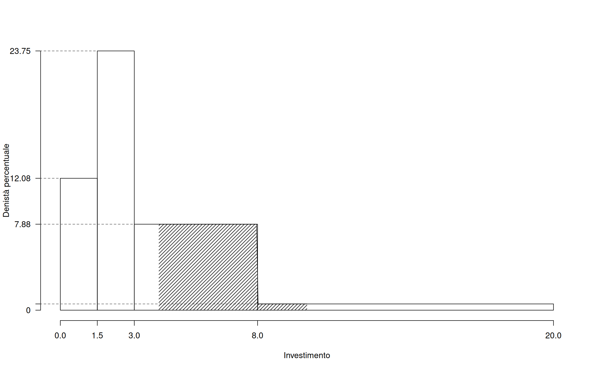
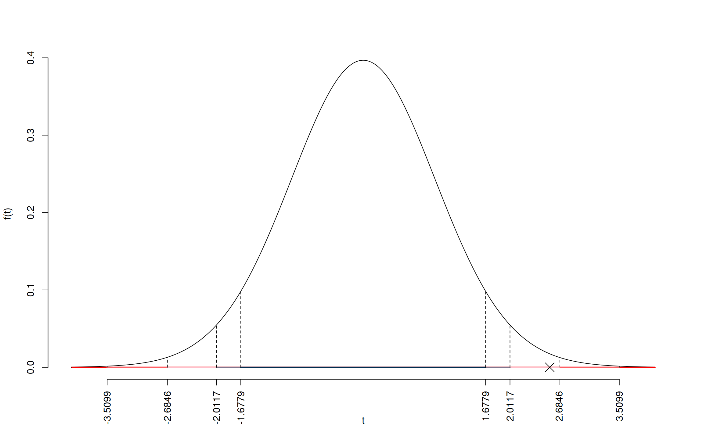

---
editor_options:
  chunk_output_type: console
date: " "
output:
  bookdown::pdf_document2:
    latex_engine: xelatex
    keep_tex: true
    toc: false
    includes:
      in_header: preamble.tex
    number_sections: false
  pdf_document:
    toc: false
    toc_depth: '6'
  html_document:
    css: sol.css
    toc: true
    toc_depth: 6
    toc_float:
      collapsed: false
      smooth_scroll: false
      df_print: paged
fontsize: 10pt
geometry: top=2cm,bottom=1.5cm,left=1.5cm,right=1.5cm
---

# Prova di Statistica (CLEAM)

\vspace*{-1.4cm}
\anagrafica{}

\thispagestyle{fancy}
\fancypagestyle{firstpage}{%
  \lhead{\textbf{Prova di Statistica (CLEAM)}}
  \rhead{\texttt{425RTI83ME1HFBV}}
  \cfoot{} % Rimuove il numero di pagina
}
\pagestyle{firstpage}

### Esercizio 1 

Su un campione di $160$ famiglie dell'Emilia-Romagna sono stati rilevati i consumi annui in beni tecnologici (dai espressi in migliaia di euro). Qui di seguito la distribuzione delle densità percentuali:

<table class="table" style="width: auto !important; margin-left: auto; margin-right: auto;">
 <thead>
  <tr>
   <th style="text-align:right;"> $[\text{x}_j,$ </th>
   <th style="text-align:right;"> $\text{x}_{j+1})$ </th>
   <th style="text-align:right;"> $h_j$ </th>
  </tr>
 </thead>
<tbody>
  <tr>
   <td style="text-align:right;"> 0.0 </td>
   <td style="text-align:right;"> 1.5 </td>
   <td style="text-align:right;"> 12.0833 </td>
  </tr>
  <tr>
   <td style="text-align:right;"> 1.5 </td>
   <td style="text-align:right;"> 3.0 </td>
   <td style="text-align:right;"> 23.7500 </td>
  </tr>
  <tr>
   <td style="text-align:right;"> 3.0 </td>
   <td style="text-align:right;"> 8.0 </td>
   <td style="text-align:right;"> 7.8750 </td>
  </tr>
  <tr>
   <td style="text-align:right;"> 8.0 </td>
   <td style="text-align:right;"> 20.0 </td>
   <td style="text-align:right;"> 0.5729 </td>
  </tr>
  <tr>
   <td style="text-align:right;">  </td>
   <td style="text-align:right;">  </td>
   <td style="text-align:right;">  </td>
  </tr>
</tbody>
</table>

1.a (pt 13/103 → 3.9/31)  Calcolare il valore approssimativo della mediana. 

:::{.sol data-latex=""}
\begin{eqnarray*}
  p &=&  0.5 , \text{essendo }F_{ 2 }= 0.5375  > 0.5  \Rightarrow j_{ 0.5 }= 2 \\
  x_{ 0.5 } &=& x_{\text{inf}; 2 } + \frac{ { 0.5 } - F_{ 1 }} {f_{ 2 }} \cdot b_{ 2 } \\
            &=&  1.5  + \frac {{ 0.5 } -  0.1812 } { 0.3563 } \cdot  1.5  \\
            &=&  2.842 
\end{eqnarray*}

:::

1.b (pt 4/103 → 1.2/31) Qual è la percentuale di famiglie spendono più del 55-esimo percentile $x_{0.55}$? 

:::{.sol data-latex=""}
Per definizione $\%(X>x_{0.55})=45\%$ e 
                                            $\#(X>x_{0.55})\approx0.45\times160 =72$
:::  

1.c (pt 2/103 → 0.6/31) La media è pari a $\bar x=4$, senza disegnare l'istogramma, che forma distributiva dobbiamo aspettarci?

1.d (pt 2/103 → 0.6/31) La spesa media è pari a $4.0009$, mentre la varianza è pari a $10.6517$.
Se ogni famiglia diminuisse la propria spesa del 2%, quanto varrebbero la media e la varianza dei dati così trasformati?

:::{.sol data-latex=""}
\[
\bar y = 3.9209\qquad \sigma^2 = 10.2299
\]
:::  

### Esercizio 2 

2.a (pt 13/103 → 3.9/31) Si consideri un'urna che ha 5 palline bianche, 5 nere e 5 verdi. Si estrae 3 volte **con**  reinserimento. Sia $X$ la variabile casuale che conta il numero di bianche su 3 estrazioni. Calcolare la probabilità che $X\leq 1$.

:::{.sol data-latex=""}
 \normalsize 
   \begin{eqnarray*}
      P( X \leq 1 ) &=& \binom{ 3 }{ 0 } 0.3333 ^{ 0 }(1- 0.3333 )^{ 3 - 0 }+\binom{ 3 }{ 1 } 0.3333 ^{ 1 }(1- 0.3333 )^{ 3 - 1 } \\                 &=& 0.2963+0.4444 \\                 &=& 0.7407 
   \end{eqnarray*}
   \normalsize 
:::  

2.b (pt 4/103 → 1.2/31) Si consideri un'urna che ha 5 palline bianche, 5 nere e 5 verdi. Si estrae 3 volte **senza**  reinserimento. Sia $X$ la variabile casuale che conta il numero di bianche su 3 estrazioni. Calcolare la probabilità che $X\leq 1$.

:::{.sol data-latex=""}
\begin{eqnarray*}
  B_i &=& \text{Bianca all'estrazione $i$}\\
  \bar B_i &=& \text{Non Bianca all'estrazione $i$}\\
  P(X\le 1) &=&  P(X=0) + P(X=1)\\
   &=& P(\bar B_1\cap\bar B_2\cap\bar B_3)+\\
   &+&P(B_1\cap\bar B_2 \cap \bar B_3)+P(\bar B_1\cap B_2 \cap \bar B_3)+P(\bar B_1\cap\bar B_2 \cap B_3)\\
   &=& \frac {10}{15}\frac {9}{14}\frac {8}{13}+3\cdot\frac {5}{15}\frac {10}{14}\frac {9}{13}\\
  &=& 0.3956
\end{eqnarray*}
:::

2.c (pt 2/103 → 0.6/31) Sia $X$ una VC definita su $S_X=\{0,1,2,3\}$, posto $Y=2X$ ricavare $S_Y$.

2.d (pt 2/103 → 0.6/31) Sia $X$ una VC, e siano $P(X\leq 1)=0.1$, $P(X> 2)=0.1$. Calcolare
$$
P(X>2|X>1)
$$

:::{.sol data-latex=""}
\begin{eqnarray}
  P(X>2|X>1) &=&  \frac{P({X>2}\cap {X>1})}{P(X> 1)}\\
             &=&  \frac{P({X>2})}{P(X> 1)}\\
             &=&   \frac{0.1}{1-0.1}\\
             &=& 0.1111
\end{eqnarray}
:::  

### Esercizio 3 

3.a (pt 13/103 → 3.9/31) Un'urna contiene 2 palline numerate con $\fbox{0}$, 6 numerate con $\fbox{1}$ e 2 numerate con $\fbox{2}$. Si estrae 100 volte con reinserimento. Qual è la probabilità che la proporzione di palline col numero $\fbox{1}$ sia minore di 0.55?

:::{.sol data-latex=""}
$$
\pi = P(\text{estrarre $\fbox{1}$})=\frac {6}{10}=0.6
$$
**Teorema del Limite Centrale (proporzione)** 

 Siano $X_1$,...,$X_n$, $n=100$ VC IID, tc $X_i\sim\text{Ber}(\pi=0.6)$$,\forall i$, posto:
      \[
      \hat\pi=\frac{S_n}n = \frac{X_1 + ... + X_n}n
      \]
      allora:\begin{eqnarray*}
  \hat\pi & \mathop{\sim}\limits_{a}& N(\pi,\pi(1-\pi)/n) \\
  &\sim & N\left(0.6,\frac{0.6\cdot(1-0.6)}{100}\right) \\
     &\sim & N(0.6,0.0024) 
  \end{eqnarray*}\begin{eqnarray*}
      P( \hat\pi   <   0.55 ) 
        &=& P\left(  \frac { \hat\pi  -  \pi }{ \sqrt{\pi(1-\pi)/n} }  <  \frac { 0.55  -  0.6 }{\sqrt{ 0.0024 }} \right)  \\
                 &=& P\left(  Z   <   -1.02 \right) \\    
                 &=&  1-\Phi( 1.02 ) \\ &=&  0.1539 
      \end{eqnarray*}
:::

### Esercizio 4 

  
4.a (pt 3/103 → 0.9/31) Siano $h_1$ e $h_2$ due stimatori per $\theta$, tali che

$$
  MSE(h_1) =  \frac{\theta}{n^2}, \qquad  MSE(h_2) =  \frac{\theta}{n}
$$

Quale dei due stimatori è più efficiente?

4.b (pt 3/103 → 0.9/31) Siano $T_1$ e $T_2$ due test statistici per la stessa $H_0$ e con la stessa significatività $\alpha$. Cosa significa dire che $T_1$ e più potente di $T_2$?

4.c (pt 3/103 → 0.9/31) Definire la probabilità di significatività osservata.

4.d (pt 3/103 → 0.9/31) Se in un test statistico che utilizza la statistica test _t_ con 10 gradi di libertà $t_\text{obs}=1.4$, il $p_\text{value}$ sarà maggiore o minore di 0.05? Perché?

### Esercizio 5 

Nel comune $A$ si è condotta un'intervista per conoscere l'opinione
dei cittadini sulla presenza di un inceneritore. Sono state intervistate
25 persone a cui è stato chiesto di esprimete l'opinione in una scala da zero a 100.
È risultato un punteggio medio pari a $\hat\mu_A=72.1$ con una standard deviation 
$\hat\sigma_A=3.4$

5.a (pt 3/103 → 0.9/31) Costruire un intervallo di confidenza al 95%
per la proporzione dei favorevoli in popolazione.

:::{.sol data-latex=""}

 $1-\alpha =0.95$ e quindi $\alpha=0.05\rightarrow \alpha/2=0.025$

\[
      S  =\sqrt{\frac {n}{n-1}}\cdot\hat\sigma =
     \sqrt{\frac { 25 }{ 24 }}\cdot 3.4 = 3.4701 
\]
\begin{eqnarray*}
  Idc: & &  \hat\mu \pm  t_{n-1;\alpha/2} \times \frac{S}{\sqrt{n}} \\
     & &  72.1 \pm  2.064 \times \frac{ 3.4701 }{\sqrt{ 25 }} \\
     & &  72.1 \pm  2.064 \times  0.694 \\
     & & [ 70.67 ,  73.53 ]
\end{eqnarray*}
:::

5.b (pt 10/103 → 3.0/31) Nel comune $B$ si è condotta un'intervista analoga. 
Sono state intervistate 23 persone si è osservata una media pari $\mu_B=69.6$ e una deviazione standard $\hat\sigma_B=3.3$.
Sotto ipotesi di omogeneità testare l'ipotesi che le medie dei due comuni siano uguali contro l'alternativa che siano diverse

:::{.sol data-latex=""}
**Test $T$ per due medie, (omogeneità)**

 \(\fbox{A}\) FORMULAZIONE DELLE IPOTESI 

   $$\begin{cases}
   H_0: \mu_\text{A} = \mu_\text{B} \\
   H_1: \mu_\text{A} \neq \mu_\text{B} 
   \end{cases}$$

\(\fbox{B}\) SCELTA E CALCOLO STATISTICA-TEST, \(T\)

  L'ipotesi è di omogeneità e quindi calcoliamo:$$
   S_p^2=\frac{n_\text{ A }\hat\sigma^2_\text{ A }+n_\text{ B }\hat\sigma^2_\text{ B }}{n_\text{ A }+n_\text{ B }-2} =
   \frac{ 25 \cdot 3.4 ^2+ 24 \cdot 3.3 ^2}{ 25 + 24 -2}= 11.71 
  $$

\begin{eqnarray*}
  \frac{\hat\mu_\text{ A } - \hat\mu_\text{ B }}
  {\sqrt{\frac {S^2_p}{n_\text{ A }}+\frac {S^2_p}{n_\text{ B }}}}&\sim&t_{n_\text{ A }+n_\text{ B }-2}\\
  t_{\text{obs}}
  &=& \frac{ ( 72.1 -  69.6 )} {\sqrt{\frac{ 11.71 }{ 25 }+\frac{ 11.71 }{ 24 }}}
  =   2.556 \, .
  \end{eqnarray*}

  

\(\fbox{C}\) CONCLUSIONE 

Siccome \(H_1\) è bilaterale, considereremo \(\alpha/2\), 
                anziché \(\alpha\)

 $\alpha=0.1, 0.05, 0.01, 0.001$ e quindi $\alpha/2=0.05, 0.025, 0.005, 0.0005$

 I valori critici sono

$t_{49-2;0.05}=1.6779$; $t_{49-2;0.025}=2.0117$; $t_{49-2;0.005}=2.6846$; $t_{49-2;0.0005}=3.5099$

Siccome $2.0117<|t_\text{obs}|=2.5565<2.6846$, quindi **rifiuto** $H_0$ al 5%, 

 $0.01<p_\text{value}<0.05$, _significativo_   $\fbox{*}$.

 Il \(p_{\text{value}}\) è 

 $$ p_{\text{value}} = P(|T_{49-2}|>|2.56|)=2P(T_{49-2}>2.56)=0.013864 $$

Attenzione il calcolo del $p_\text{value}$ con la $T$ è puramente illustrativo e non può essere riprodotto senza una calcolatrice statistica adeguata.\[
 0.01 < p_\text{value}= 0.013864 \leq 0.05 
\]
:::

### Esercizio 6 

Sono stati analizzati 15 comuni della provincia di Bologna e su ogni comune è stato rilevato
il PIL pro capite del comune $X$, espresso in decine di migliaia di euro e un valore di percezione di
qualità della vita $Y$ (espresso su opportuna scala).

Qui di seguito le statistiche bivariate

\begin{align*}
  \sum_{i=1}^n x_i &= 29.3 &\sum_{i=1}^n x_i^2 &= 74.51 &\sum_{i=1}^n x_i y_i &= 242.81\\
  \sum_{i=1}^n y_i &= 110.8 & \sum_{i=1}^n y_i^2 &= 866.02 &
\end{align*}

6.a (pt 13/103 → 3.9/31) Stimare la previsione per $x=1.6$ nel modello di regressione dove $Y$ viene spiegata da $X$.

:::{.sol data-latex=""}
\begin{eqnarray*}
           \bar x &=&\frac 1 n\sum_{i=1}^n x_i = \frac {1}{ 15 }  29.3 =  1.953 \\
           \bar y &=&\frac 1 n\sum_{i=1}^n y_i = \frac {1}{ 15 }  110.8 =  7.387 \\
           \hat\sigma_X^2&=&\frac 1 n\sum_{i=1}^n x_i^2-\bar x^2=\frac {1}{ 15 }  74.51  - 1.9533 ^2= 1.152 \\
           \hat\sigma_Y^2&=&\frac 1 n\sum_{i=1}^n y_i^2-\bar y^2=\frac {1}{ 15 }  866  - 7.3867 ^2= 3.172 \\
           \text{cov}(X,Y)&=&\frac 1 n\sum_{i=1}^n x_i~y_i-\bar x\bar y=\frac {1}{ 15 }  242.8 - 1.9533 \cdot 7.3867 = 1.759 \\
           \hat\beta_1 &=& \frac{\text{cov}(X,Y)}{\hat\sigma_X^2} \\
                    &=& \frac{ 1.759 }{ 1.152 }  =  1.527 \\
           \hat\beta_0 &=& \bar y - \hat\beta_1 \bar x\\
                    &=&  7.387 - 1.5269 \times  1.9533 = 4.404 
         \end{eqnarray*}\[\hat y_{X= 1.6 }=\hat\beta_0+\hat\beta_1 x= 4.404 + 1.5269 \times 1.6 = 6.847 \]
:::

6.b (pt 4/103 → 1.2/31) Calcolare numericamente $RSS$:
$$
RSS=\sum_{i=1}^n \hat\epsilon_i^2
$$

:::{.sol data-latex=""}
$$RSS=n(1-r^2)\hat\sigma_Y^2=7.2968$$
:::

6.c (pt 2/103 → 0.6/31) Gli stimatori $\hat\beta_0$ e $\hat\beta_1$ sono consistenti? 
Perché?

6.d (pt 2/103 → 0.6/31) Se in un modello di regressione con 11 dati, 
il residuo studentizzato del dato $i$ è $\tilde \epsilon_i=1.23$, cosa possiamo concludere?

6.e (pt 2/103 → 0.6/31) Sia $\hat\beta_1$ lo stimatore dei minimi quadrati per $\beta_1$.
Scrivere il suo Standard Error teorico.

