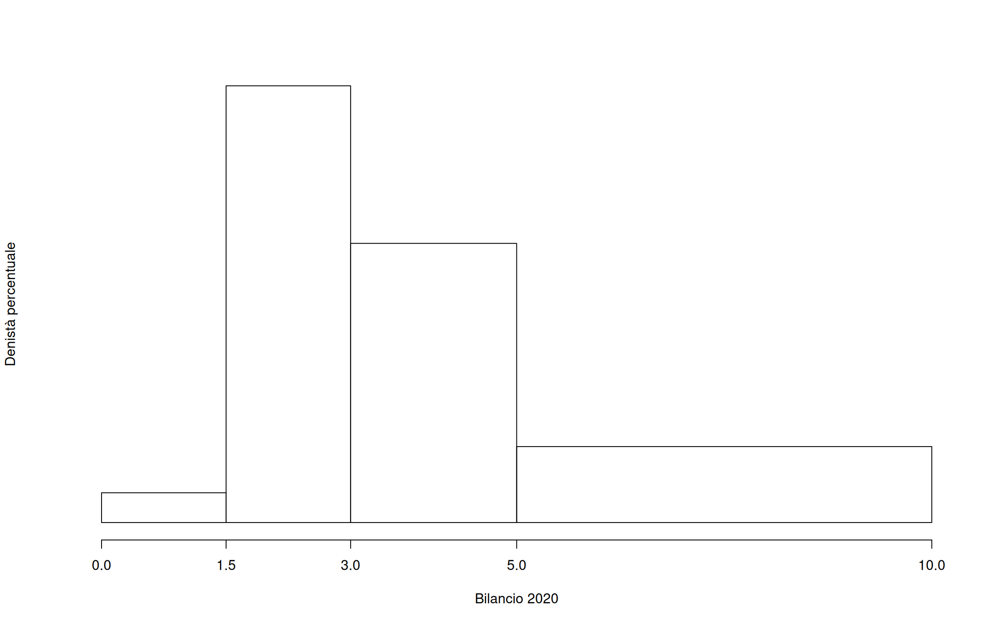
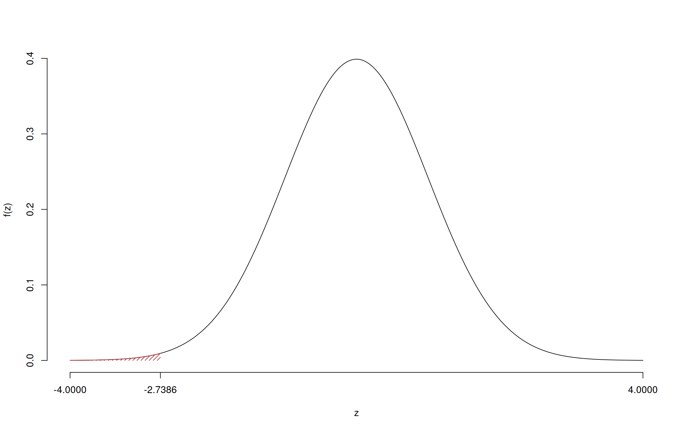

---
editor_options:
  chunk_output_type: console
date: " "
output:
  bookdown::pdf_document2:
    latex_engine: xelatex
    keep_tex: true
    toc: false
    includes:
      in_header: preamble.tex
    number_sections: false
  pdf_document:
    toc: false
    toc_depth: '6'
  html_document:
    css: sol.css
    toc: true
    toc_depth: 6
    toc_float:
      collapsed: false
      smooth_scroll: false
      df_print: paged
fontsize: 10pt
geometry: top=2cm,bottom=1.5cm,left=1.5cm,right=1.5cm
---


<div class="button-container"></div>

# Prova di Statistica (CLEAM)

\vspace*{-1.4cm}
\anagrafica{}

\thispagestyle{fancy}
\fancypagestyle{firstpage}{%
  \lhead{\textbf{Prova di Statistica (CLEAM)}}
  \rhead{\texttt{SFR4YL1HNGTXD7M}}
  \cfoot{} % Rimuove il numero di pagina
}
\pagestyle{firstpage}


### Esercizio 1 


Su un campione di $220$ imprese della provincia di Milano è stato 
rilevato il bilancio, espresso in migliaia di euro, del 2020. Qui di seguito i dati raccolti in classi
e le frequenze percentuali.

:::{.sol data-latex=""}
<table class="table" style="width: auto !important; margin-left: auto; margin-right: auto;">
 <thead>
  <tr>
   <th style="text-align:right;"> $[\text{x}_j,$ </th>
   <th style="text-align:right;"> $\text{x}_{j+1})$ </th>
   <th style="text-align:right;"> $f_{j\%}$ </th>
  </tr>
 </thead>
<tbody>
  <tr>
   <td style="text-align:right;"> 0.0 </td>
   <td style="text-align:right;"> 1.5 </td>
   <td style="text-align:right;"> 2.727 </td>
  </tr>
  <tr>
   <td style="text-align:right;"> 1.5 </td>
   <td style="text-align:right;"> 3.0 </td>
   <td style="text-align:right;"> 40.000 </td>
  </tr>
  <tr>
   <td style="text-align:right;"> 3.0 </td>
   <td style="text-align:right;"> 5.0 </td>
   <td style="text-align:right;"> 34.091 </td>
  </tr>
  <tr>
   <td style="text-align:right;"> 5.0 </td>
   <td style="text-align:right;"> 10.0 </td>
   <td style="text-align:right;"> 23.182 </td>
  </tr>
  <tr>
   <td style="text-align:right;">  </td>
   <td style="text-align:right;">  </td>
   <td style="text-align:right;"> 100.000 </td>
  </tr>
</tbody>
</table>
:::

1.a (pt 14/102 → 4.3/31) Individuare la classe modale.

:::{.sol data-latex=""}
<table class="table" style="width: auto !important; margin-left: auto; margin-right: auto;">
 <thead>
  <tr>
   <th style="text-align:right;"> $[\text{x}_j,$ </th>
   <th style="text-align:right;"> $\text{x}_{j+1})$ </th>
   <th style="text-align:right;"> $n_j$ </th>
   <th style="text-align:right;"> $f_j$ </th>
   <th style="text-align:right;"> $b_j$ </th>
   <th style="text-align:right;"> $h_j$ </th>
   <th style="text-align:right;"> $F_j$ </th>
  </tr>
 </thead>
<tbody>
  <tr>
   <td style="text-align:right;"> 0.0 </td>
   <td style="text-align:right;"> 1.5 </td>
   <td style="text-align:right;"> 6 </td>
   <td style="text-align:right;"> 0.0273 </td>
   <td style="text-align:right;"> 1.5 </td>
   <td style="text-align:right;"> 1.818 </td>
   <td style="text-align:right;"> 0.0273 </td>
  </tr>
  <tr>
   <td style="text-align:right;"> 1.5 </td>
   <td style="text-align:right;"> 3.0 </td>
   <td style="text-align:right;"> 88 </td>
   <td style="text-align:right;"> 0.4000 </td>
   <td style="text-align:right;"> 1.5 </td>
   <td style="text-align:right;"> 26.667 </td>
   <td style="text-align:right;"> 0.4273 </td>
  </tr>
  <tr>
   <td style="text-align:right;"> 3.0 </td>
   <td style="text-align:right;"> 5.0 </td>
   <td style="text-align:right;"> 75 </td>
   <td style="text-align:right;"> 0.3409 </td>
   <td style="text-align:right;"> 2.0 </td>
   <td style="text-align:right;"> 17.046 </td>
   <td style="text-align:right;"> 0.7682 </td>
  </tr>
  <tr>
   <td style="text-align:right;"> 5.0 </td>
   <td style="text-align:right;"> 10.0 </td>
   <td style="text-align:right;"> 51 </td>
   <td style="text-align:right;"> 0.2318 </td>
   <td style="text-align:right;"> 5.0 </td>
   <td style="text-align:right;"> 4.636 </td>
   <td style="text-align:right;"> 1.0000 </td>
  </tr>
  <tr>
   <td style="text-align:right;">  </td>
   <td style="text-align:right;">  </td>
   <td style="text-align:right;"> 220 </td>
   <td style="text-align:right;"> 1.0000 </td>
   <td style="text-align:right;"> 10.0 </td>
   <td style="text-align:right;">  </td>
   <td style="text-align:right;">  </td>
  </tr>
</tbody>
</table>


:::

1.b (pt 3/102 → 0.9/31) Quante imprese hanno un bilancio compreso tra $-4$ mila 
euro e zero.

:::{.sol data-latex=""}
$$\#(-1<X<0)=\frac{(0-(-4))26.6667}{100}\times 220=0$$
:::

1.c (pt 2/102 → 0.6/31)  La media è risultata essere $\bar x=3.9865$; che
relazione mi devo aspettare tra mediana e moda?

:::{.sol data-latex=""}
$$\bar x<x_{0.5}<x_{Mo}$$
:::

1.d (pt 2/102 → 0.6/31) Siano $x_1,...,x_n$, $n$ numeri, $n$ dispari. 
Si consideri la funzione:
$$g(x)=|x_1-x|+...+|x_n-x|.$$
Per quale valore di $x$, $g(x)$ è minima?

:::{.sol data-latex=""}
La funzione $g$ è minimizzata nel valore della mediana.
$$x_{0.5}=x_{((n+1)/2)}$$
:::


### Esercizio 2 

  
Una moneta perfetta viene lanciata 5 volte, se esce almeno 3 volte testa si estrae da un'urna che contiene
un biglietto vincente ed uno perdente, altrimenti si estrae da un'urna che contine due biglietti vincenti e tre perdenti.

2.a (pt 14/102 → 4.3/31) Qual è la probabilità di vincere?

:::{.sol data-latex=""}


\begin{eqnarray*}
  P(X=3) &=& 0.1323\\
  P(X=4) &=& 0.0284\\
  P(X=5) &=& 0.0024\\
  P(X\ge 3)  &=& 0.5\\
  P(\text{Vincere})&=& 0.5\frac12+(1-0.5)\frac23\\
  &=& 0.5833
\end{eqnarray*}
:::
  


2.b (pt 3/102 → 0.9/31) Si ripete il gioco di sopra finché non si vince due volte. Qual è la probabilità di finire alla quarta giocata?


:::{.sol data-latex=""}
$$
3\times 0.5833\times (1-0.5833)^3\times 0.5833 = 0.0738
$$
:::

2.c (pt 2/102 → 0.6/31) Se $X\sim \text{Pois}(2)$ e $Y\sim\text{Pois}(1)$, è vero che
$$
X-Y\sim\text{Pois}(1)\qquad ?
$$


2.d (pt 2/102 → 0.6/31) Se $X$ è una VC con supporto {0,1,2} e $X$ è una VC con supporto {-2,-1,0}.
Qual è il supporto di $X\times Y$?

$$
\{-4,-2,-1,0\}
$$


### Esercizio 3 


3.a (pt 14/102 → 4.3/31) Un'urna contiene 4 palline numerate da 1 a 4. 
Si estrae 100 volte con reinserimento e si fa la media dei 100 numeri
estratti. Qual è la probabilità che la media sia compresa tra 2.5 e 2.6?

:::{.sol data-latex=""}
\begin{eqnarray*} \mu &=& E(X_i) = \sum_{x\in S_X}x P(X=x)\\ 
 &=&  1  \frac { 1 }{ 4 }+ 2  \frac { 1 }{ 4 }+ 3  \frac { 1 }{ 4 }+ 4  \frac { 1 }{ 4 } \\ 
            &=& 2.5 \\ 
 \sigma^2 &=& V(X_i) = \sum_{x\in S_X}x^2 P(X=x)-\mu^2\\ 
 &=&\left(  1  ^2\frac { 1 }{ 4 }+ 2  ^2\frac { 1 }{ 4 }+ 3  ^2\frac { 1 }{ 4 }+ 4  ^2\frac { 1 }{ 4 } \right)-( 2.5 )^2\\ 
            &=& 1.25 
\end{eqnarray*}
**Teorema del Limite Centrale (media VC qualunque)** 

 Siano $X_1$,...,$X_n$, $n=100$ VC IID, tc $E(X_i)=\mu=2.5$ e $V(X_i)=\sigma^2=1.25,\forall i$, posto:
      \[
      \bar X=\frac{S_n}n =\frac{X_1 + ... + X_n}n
      \]
      allora:\begin{eqnarray*}
  \bar X & \mathop{\sim}\limits_{a}& N(\mu,\sigma^2/n) \\
     &\sim & N\left(2.5,\frac{1.25}{100}\right) \\
     &\sim & N(2.5,0.0125)
  \end{eqnarray*}\begin{eqnarray*}
   P( 2.5 < \bar X \leq  2.6 ) &=& P\left( \frac { 2.5  -  2.5 }{\sqrt{ 0.0125 }} < \frac { \bar X  -  \mu }{ \sqrt{\sigma^2/n} } \leq \frac { 2.6  -  2.5 }{\sqrt{ 0.0125 }}\right)  \\
              &=& P\left(  0  < Z \leq  0.89 \right) \\
              &=& \Phi( 0.89 )-\Phi( 0 )\\
              &=&  0.8133 - 0.5 \\ 
              &=&  0.3133 
   \end{eqnarray*}
   
:::


### Esercizio 4 


4.a (pt 3/102 → 0.9/31) Sia $h$ uno stimatore per theta, tale che
$$
E(h)=\theta+\frac\theta {\sqrt{ n}}
$$
$h$ è corretto? $h$ è asintoticamente corretto?

::: {.sol data-latex=""}
$h$ **non è corretto**, infatti
$$
E(h)=\theta+\frac\theta {\sqrt{ n}}\neq\theta
$$
$h$ **è asintoticamente corretto**, infatti
$$
\lim_{n\to\infty}E(h)=\lim_{n\to\infty}\left(\theta+\frac\theta {\sqrt{ n}}\right)=\theta+0=\theta
$$
:::

4.b (pt 3/102 → 0.9/31) Siano $h_1$ e $h_2$ due stimatori per $\theta$, tali che:
\begin{eqnarray*}
MSE(h_1) &=&   \frac\theta n\\
MSE(h_2) &=&   \frac{2\theta} n
\end{eqnarray*}
Quale dei due stimatori è più efficiente? Perché?

::: {.sol data-latex=""}
$h_1$ **è più efficiente** di $h_2$, infatti
\begin{eqnarray*}
MSE(h_1) &=&   \frac\theta n\\
MSE(h_2) &=&   \frac{2\theta} n =2\cdot MSE(h_1)>MSE(h_1)
\end{eqnarray*}
:::

4.c (pt 3/102 → 0.9/31) Si sono osservati due gruppi di dati quantitativi e si è osservato, $\hat\mu_1=10.2$ e $\hat\mu_2=15.6$. Posto a test
$$
\begin{cases}
H_0:\mu_1=\mu_2\\
H_1:\mu_1\ne \mu_2
\end{cases}
$$
è risultato $p_\text{value}=0.0612$. La differenza tra $\hat\mu_1$ e $\hat\mu_2$ è significativa? Perché?

::: {.sol data-latex=""}
Il $p_\text{value}$ è maggiore di 0.05, la differenza **non è significativa** per ogni livello di significatività.
:::


### Esercizio 5 


5.a (pt 4/102 → 1.2/31) Su un campione di \( n = 120 \) startup tecnologiche italiane, è stato chiesto se abbiano implementato misure di cybersecurity avanzate. Lo studio ha riportato che 84 startup su 120 (il 70% del campione) hanno implementato queste misure.

Costruire un intervallo di confidenza al 95% per \(\pi\), la quota di startup italiane che hanno implementato misure di cybersecurity avanzate.

:::{.sol data-latex=""}

 $1-\alpha =0.95$ e quindi $\alpha=0.05\rightarrow \alpha/2=0.025$

\[
  \hat\pi = \frac{S_n}n = \frac{ 84 }{ 120 }= 0.7 
\]

\begin{eqnarray*}
  Idc: & &  \hat\pi \pm  z_{\alpha/2} \times \sqrt{\frac{\hat\pi(1-\hat\pi)}{n}} \\
     & &  0.7 \pm  1.96 \times \sqrt{\frac{ 0.7 (1- 0.7 )}{ 120 }} \\
     & &  0.7 \pm  1.96 \times  0.04183 \\
     & & [ 0.618 ,  0.782 ]
\end{eqnarray*}
:::

5.b (pt 10/102 → 3.0/31) Un'indagine molto più ampia condotta su startup europee ha mostrato che la percentuale di startup con misure di cybersecurity avanzate è del 80%. Testare l'ipotesi che in Italia la quota di startup con misure di cybersecurity avanzate sia uguale a quella europea contro l'alternativa che sia minore. Risolvere col $p_\text{value}$ e confrontarlo per $\alpha=0.1,0.05,0.01,0.001$.

:::{.sol data-latex=""}
**Test $Z$ per una proporzione**

La stima
   $$\hat\pi=\frac { 84 } { 120 }= 0.7  $$

 \(\fbox{A}\) FORMULAZIONE DELLE IPOTESI 


   $$\begin{cases}
   H_0: \pi = \pi_0=0.8 \\
   H_1: \pi < \pi_0=0.8 
   \end{cases}$$


 \(\fbox{B}\) SCELTA E CALCOLO STATISTICA-TEST, \(Z\)
        Test Binomiale per \(n\) grande: \(\Rightarrow\) z-Test.


   \begin{eqnarray*}
   \frac{\hat\pi - \pi_{0}} {\sqrt {\pi_0(1-\pi_0)/\,n}}&\sim&N(0,1)\\
   z_{\text{obs}}
   &=& \frac{ ( 0.7 -  0.8 )} {\sqrt{ 0.8 (1- 0.8 )/ 120 }}
   =   -2.739 \,.
   \end{eqnarray*}

\(\fbox{C}\) CONCLUSIONE 


 Il \(p_{\text{value}}\) è 

 $$ p_{\text{value}} = P(Z<-2.74)=0.003085 $$

\[
 0.001 < p_\text{value}= 0.003085 \leq 0.01 
\]

 **Rifiuto** $H_0$ all'1%, 

 $0.001<p_\text{value}<0.01$, _molto significativo_  $\fbox{**}$.
:::


### Esercizio 6 


In uno studio sulla formazione aziendale, in un campione di \(n=30\) dipendenti, sono state analizzate le ore di formazione (in ore, \(X\)) e il punteggio di performance (in opportuna, \(Y\)).

Si osservano le seguenti statistiche:
$\sum_{i=1}^{30}x_i=1036.68$, $\sum_{i=1}^{30}y_i=538.81$,
$\sum_{i=1}^{30}x_i^2=39787.25$, $\sum_{i=1}^{30}y_i^2=10684.19$ e $\sum_{i=1}^{30}x_iy_i=20527.76$.


6.a (pt 14/102 → 4.3/31) Si è osservato $x_7=39.46$ e $y_7=18.26$, stimare il modello di regressione dove $Y$ viene spiegata da $X$ e calcolare il residuo per il punto $i=7$.

:::{.sol data-latex=""}
\begin{eqnarray*}
           \bar x &=&\frac 1 n\sum_{i=1}^n x_i = \frac {1}{ 30 }  1036.68 =  34.56 \\
           \bar y &=&\frac 1 n\sum_{i=1}^n y_i = \frac {1}{ 30 }  538.81 =  17.96 \\
           \hat\sigma_X^2&=&\frac 1 n\sum_{i=1}^n x_i^2-\bar x^2=\frac {1}{ 30 }  39787  - 34.556 ^2= 132.1 \\
           \hat\sigma_Y^2&=&\frac 1 n\sum_{i=1}^n y_i^2-\bar y^2=\frac {1}{ 30 }  10684  - 17.9603 ^2= 33.57 \\
           \text{cov}(X,Y)&=&\frac 1 n\sum_{i=1}^n x_i~y_i-\bar x\bar y=\frac {1}{ 30 }  20528 - 34.556 \cdot 17.9603 = 63.62 \\
           \hat\beta_1 &=& \frac{\text{cov}(X,Y)}{\hat\sigma_X^2} \\
                    &=& \frac{ 63.62 }{ 132.1 }  =  0.4815 \\
           \hat\beta_0 &=& \bar y - \hat\beta_1 \bar x\\
                    &=&  17.96 - 0.4815 \times  34.556 = 1.321 
         \end{eqnarray*}\begin{eqnarray*}
\hat y_i &=&\hat\beta_0+\hat\beta_1 x_i=\\ 
&=& 1.321 + 0.4815 \times 39.46 = 20.32 \\ 
\hat \varepsilon_i &=& y_i-\hat y_i\\ 
&=& 18.26 - 20.3217 = -2.062  
\end{eqnarray*}
:::

6.b (pt 3/102 → 0.9/31) Dare un'interpretazione dei parametri di regressione stimati.

6.c (pt 2/102 → 0.6/31) Perché la previsione per $x=35$ è più affidabile di quella per $x=346$?

6.d (pt 2/102 → 0.6/31) Cosa significa che $r$ è un numero puro?

6.e (pt 2/102 → 0.6/31) Se in un modello di regressione \(r=0.65\), \(\hat\sigma_X=1.1\) e \(\hat\sigma_Y=0.9\), calcolare \(\hat\beta_1\).

:::{.sol data-latex=""}
Per calcolare \(\hat\beta_1\) in un modello di regressione, si usa la formula:

\[
\hat\beta_1 = r \frac{\hat\sigma_Y}{\hat\sigma_X}
\]

Dati:
- \(r = 0.65\)
- \(\hat\sigma_X = 1.1\)
- \(\hat\sigma_Y = 0.9\)

Calcolo:

\[
\hat\beta_1 = 0.65 \times \frac{0.9}{1.1} = 0.65 \times 0.8182 = 0.532
\]
:::

<!-- 6.f (pt NA/102 → NA/31) Testare l'ipotesi che $\beta_1$ sia uguale a zero, contro l'alternativa che sia diverso per $\alpha=0.1,0.05,0.01,0.001$ e dare una valutazione approssimativa del $p_\text{value}$ (ad esempio il $p_\text{value}$ è minore di 0.001, compreso tra 0.05 e tra 0.01, ecc.). -->

<!-- :::{.sol data-latex=""} -->
<!-- ```{r 2024-113} -->
<!-- ttest_beta(1,0,SE = T) -->
<!-- ``` -->
<!-- ::: -->


